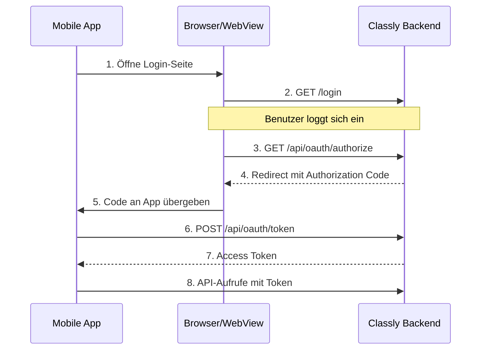

# 🔐 OAuth 2.0 Dokumentation

OAuth 2.0 ermöglicht es externen Apps, sich im Namen eines Benutzers zu authentifizieren.

::: tip Wann OAuth verwenden?
OAuth ist ideal für **Mobile Apps** und **Drittanbieter-Integrationen**, bei denen sich der Benutzer selbst anmelden soll.
:::

---

## Übersicht

Classly implementiert den **OAuth 2.0 Authorization Code Flow**:


```mermaid
sequenceDiagram
    participant App as Mobile App
    participant Browser as Browser/WebView
    participant Classly as Classly Backend
    
    App->>Browser: 1. Öffne Login-Seite
    Browser->>Classly: 2. GET /login
    Note over Browser,Classly: Benutzer loggt sich ein
    Browser->>Classly: 3. GET /api/oauth/authorize
    Classly-->>Browser: 4. Redirect mit Authorization Code
    Browser->>App: 5. Code an App übergeben
    App->>Classly: 6. POST /api/oauth/token
    Classly-->>App: 7. Access Token
    App->>Classly: 8. API-Aufrufe mit Token
```

---

## Schritt 1: Authorization Request

Leite den Benutzer zur Classly-Login-Seite weiter:

```
https://classly.site/api/oauth/authorize
  ?client_id=YOUR_CLIENT_ID
  &redirect_uri=YOUR_REDIRECT_URI
  &scope=read:events
  &response_type=code
```

### Parameter

| Parameter | Typ | Erforderlich | Beschreibung |
|-----------|-----|--------------|--------------|
| `client_id` | string | ✅ | Eindeutige Client-ID deiner App |
| `redirect_uri` | string | ✅ | Redirect-URI nach erfolgreicher Authentifizierung |
| `scope` | string | ❌ | Berechtigungen (Standard: `read:events`) |
| `response_type` | string | ❌ | Muss `code` sein |

### Beispiel: Flutter App

```dart
final authUrl = Uri.parse(
  'https://classly.site/api/oauth/authorize'
  '?client_id=classly-mobile'
  '&redirect_uri=classly://auth/callback'
  '&scope=read:events'
  '&response_type=code'
);

// WebView oder Browser öffnen
launchUrl(authUrl);
```

### Beispiel: React Native

```javascript
const authUrl = 'https://classly.site/api/oauth/authorize' +
  '?client_id=classly-mobile' +
  '&redirect_uri=classly://auth/callback' +
  '&scope=read:events' +
  '&response_type=code';

Linking.openURL(authUrl);
```

---

## Schritt 2: Benutzer-Login

Der Benutzer wird zur Classly-Login-Seite weitergeleitet und meldet sich an.

Nach erfolgreichem Login wird der Benutzer zur `redirect_uri` weitergeleitet:

```
classly://auth/callback?code=abc123def456...
```

---

## Schritt 3: Token Exchange

Tausche den Authorization Code gegen einen Access Token:

```bash
curl -X POST "https://classly.site/api/oauth/token" \
  -d "grant_type=authorization_code" \
  -d "code=abc123def456..." \
  -d "client_id=YOUR_CLIENT_ID" \
  -d "redirect_uri=YOUR_REDIRECT_URI"
```

### Request Parameter

| Parameter | Typ | Erforderlich | Beschreibung |
|-----------|-----|--------------|--------------|
| `grant_type` | string | ✅ | Muss `authorization_code` sein |
| `code` | string | ✅ | Der Authorization Code aus Schritt 2 |
| `client_id` | string | ✅ | Deine Client-ID |
| `client_secret` | string | ❌ | Optional für öffentliche Clients |
| `redirect_uri` | string | ✅ | Muss mit Schritt 1 übereinstimmen |

### Response

```json
{
  "access_token": "pat_xyz789...",
  "token_type": "bearer",
  "expires_at": null,
  "scope": "read:events",
  "class_id": "class-uuid-1234"
}
```

---

## Schritt 4: API-Aufrufe

Verwende den Access Token für API-Aufrufe:

```bash
curl -X GET "https://classly.site/api/events" \
  -H "Authorization: Bearer pat_xyz789..."
```

---

## Endpoints

### GET `/api/oauth/authorize`

Erstellt einen Authorization Code für den OAuth-Flow.

**Voraussetzungen:** Benutzer muss eingeloggt sein. Wenn nicht, wird zur Login-Seite weitergeleitet.

---

### POST `/api/oauth/token`

Tauscht einen Authorization Code gegen einen Access Token.

---

### GET `/api/oauth/userinfo`

Gibt Informationen über den authentifizierten Benutzer zurück.

**Header:**
```
Authorization: Bearer YOUR_ACCESS_TOKEN
```

**Response:**
```json
{
  "sub": "user-uuid-123",
  "name": "Max Mustermann",
  "role": "member",
  "class_id": "class-uuid-456",
  "class_name": "10b",
  "email": "max@example.com",
  "is_registered": true
}
```

---

## Verfügbare Scopes

| Scope | Beschreibung |
|-------|--------------|
| `read:events` | Events der Klasse lesen |

::: info
OAuth 2.0 hat einen vereinfachten Scope-Set. Für granulare Berechtigungen verwende [API v1 mit API-Keys](/development/api-v1).
:::

---

## Client-Registrierung

Classly unterstützt mehrere OAuth-Clients. Jeder Client kann eine oder mehrere explizit registrierte Redirect-URIs besitzen.

Wichtige Regeln:

- `client_id` muss registriert sein
- `redirect_uri` muss exakt zu einer registrierten URI des Clients passen
- dieselbe Prüfung passiert in `/api/oauth/authorize` und `/api/oauth/token`
- es gibt keine Wildcards oder Prefix-Matches

Offizieller Mobile-Client:

| Client-ID | Beschreibung | Erlaubte Redirect-URIs |
|-----------|--------------|------------------------|
| `classly-mobile` | Offizielle Classly Mobile App | `classly://auth/callback` |
| `habiter-app` | Legacy-Client mit weiterem Support | `habiter://auth/callback` |

Weitere Clients können serverseitig registriert werden, zum Beispiel für Dev-, Beta- oder Partner-Apps.

---

## Code-Beispiele

### Flutter (Dart)

```dart
import 'package:url_launcher/url_launcher.dart';
import 'package:http/http.dart' as http;
import 'dart:convert';

class ClasslyAuth {
  static const clientId = 'classly-mobile';
  static const redirectUri = 'classly://auth/callback';
  
  // Schritt 1: Login starten
  Future<void> startLogin() async {
    final url = Uri.parse(
      'https://classly.site/api/oauth/authorize'
      '?client_id=$clientId'
      '&redirect_uri=$redirectUri'
      '&scope=read:events'
      '&response_type=code'
    );
    await launchUrl(url);
  }
  
  // Schritt 2: Code gegen Token tauschen
  Future<String?> exchangeCode(String code) async {
    final response = await http.post(
      Uri.parse('https://classly.site/api/oauth/token'),
      body: {
        'grant_type': 'authorization_code',
        'code': code,
        'client_id': clientId,
        'redirect_uri': redirectUri,
      },
    );
    
    if (response.statusCode == 200) {
      final data = jsonDecode(response.body);
      return data['access_token'];
    }
    return null;
  }
  
  // Schritt 3: User-Info abrufen
  Future<Map<String, dynamic>?> getUserInfo(String token) async {
    final response = await http.get(
      Uri.parse('https://classly.site/api/oauth/userinfo'),
      headers: {'Authorization': 'Bearer $token'},
    );
    
    if (response.statusCode == 200) {
      return jsonDecode(response.body);
    }
    return null;
  }
}
```

### React Native (JavaScript)

```javascript
import { Linking } from 'react-native';

const CLIENT_ID = 'classly-mobile';
const REDIRECT_URI = 'classly://auth/callback';

// Schritt 1: Login starten
const startLogin = () => {
  const authUrl = 'https://classly.site/api/oauth/authorize' +
    `?client_id=${CLIENT_ID}` +
    `&redirect_uri=${encodeURIComponent(REDIRECT_URI)}` +
    '&scope=read:events' +
    '&response_type=code';
  
  Linking.openURL(authUrl);
};

// Schritt 2: Deep Link Handler
Linking.addEventListener('url', async ({ url }) => {
  const match = url.match(/code=([^&]+)/);
  if (match) {
    const code = match[1];
    const token = await exchangeCode(code);
    // Token speichern...
  }
});

// Schritt 3: Token Exchange
const exchangeCode = async (code) => {
  const response = await fetch('https://classly.site/api/oauth/token', {
    method: 'POST',
    headers: { 'Content-Type': 'application/x-www-form-urlencoded' },
    body: new URLSearchParams({
      grant_type: 'authorization_code',
      code: code,
      client_id: CLIENT_ID,
      redirect_uri: REDIRECT_URI,
    }),
  });
  
  const data = await response.json();
  return data.access_token;
};
```

---

## Fehlerbehandlung

### Häufige Fehler

| Fehler | Ursache | Lösung |
|--------|---------|--------|
| `invalid_client` | Unbekannte Client-ID | Client registrieren |
| `invalid_grant` | Code abgelaufen oder ungültig | Neuen Login starten |
| `redirect_uri_mismatch` | URI stimmt nicht überein | Exakt gleiche URI verwenden |

### Mehrere Clients und Redirect-URIs

Classly kann mehrere OAuth-Clients gleichzeitig verwalten, zum Beispiel:

- `classly-mobile` für die offizielle Mobile-App
- `habiter-app` als Legacy-Client mit weiterem Support
- `classly-mobile-dev` für lokale oder interne Builds
- weitere Partner- oder Integrations-Clients

Ein Client kann serverseitig mehrere Redirect-URIs erhalten. Die Validierung bleibt dabei strikt: nur explizit registrierte Redirect-URIs sind erlaubt.

### Token-Ablauf

Access Tokens laufen standardmäßig **nicht ab**. Wenn ein Token ungültig wird (z.B. manuell widerrufen), erhältst du einen `401 Unauthorized` Fehler.

In diesem Fall sollte die App einen neuen Login-Flow starten.
