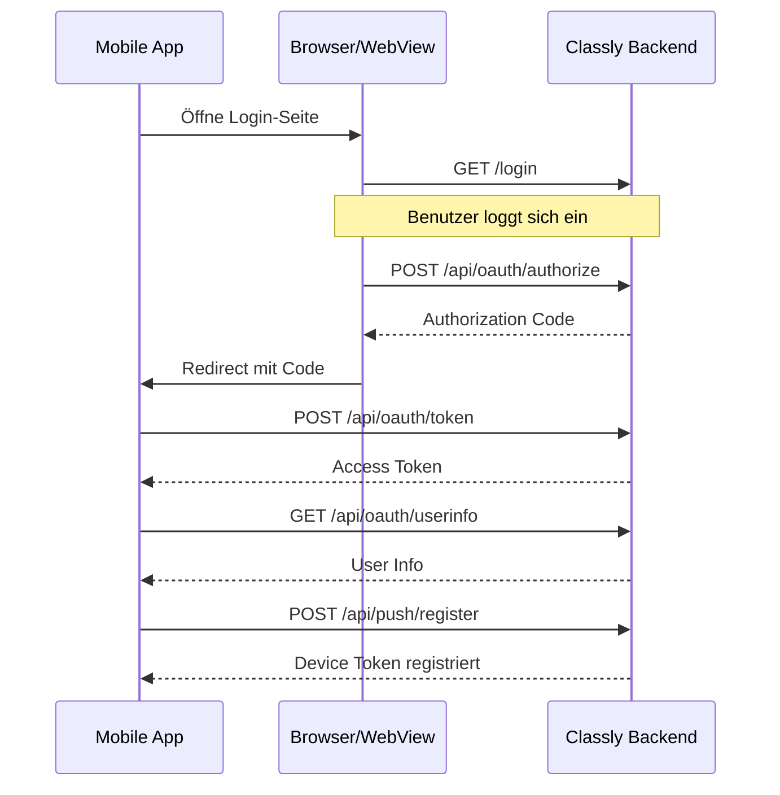

# 🔌 API Referenz

Diese Dokumentation beschreibt die REST API Endpoints von Classly für externe Integrationen, mobile Apps und OAuth-Authentifizierung.

## Authentifizierung

Classly unterstützt zwei Authentifizierungsmethoden:

### 1. API Token (Bearer Token)
Für einfache API-Zugriffe kann ein persönlicher Access Token verwendet werden:

```bash
curl -X GET "https://your-classly.com/api/events" \
  -H "Authorization: Bearer YOUR_API_TOKEN"
```

### 2. OAuth 2.0
Für mobile Apps und Drittanbieter-Integrationen wird OAuth 2.0 Authorization Code Flow empfohlen.

---

## OAuth 2.0 Endpoints

### GET `/api/oauth/authorize`

Erstellt einen Authorization Code für den OAuth-Flow.

**Voraussetzungen:** Benutzer muss eingeloggt sein. Wenn nicht, wird zur Login-Seite weitergeleitet.

**Request (Query Parameters):**
| Parameter | Typ | Erforderlich | Beschreibung |
|-----------|-----|--------------|--------------|
| `client_id` | string | ✅ | Die Client-ID der App (z.B. `habiter-app`) |
| `redirect_uri` | string | ✅ | Die Redirect-URI der App (z.B. `habiter://auth/callback`) |
| `scope` | string | ❌ | Berechtigungen (Standard: `read:events`) |
| `response_type` | string | ❌ | Muss `code` sein |

**Response:**
Redirected zur `redirect_uri` mit dem Authorization Code als Parameter:
`habiter://auth/callback?code=abc123...`

---

### POST `/api/oauth/token`

Tauscht einen Authorization Code gegen einen Access Token.

**Request (Form Data):**
| Parameter | Typ | Erforderlich | Beschreibung |
|-----------|-----|--------------|--------------|
| `grant_type` | string | ✅ | Muss `authorization_code` sein |
| `code` | string | ✅ | Der Authorization Code |
| `client_id` | string | ✅ | Die Client-ID der App |
| `client_secret` | string | ❌ | Client Secret (optional für öffentliche Clients) |
| `redirect_uri` | string | ✅ | Muss mit `/authorize` übereinstimmen |

**Response:**
```json
{
  "access_token": "pat_xyz789...",
  "token_type": "bearer",
  "expires_at": null,
  "scope": "read:events",
  "class_id": "uuid-1234"
}
```

---

### GET `/api/oauth/userinfo`

Gibt Informationen über den authentifizierten Benutzer zurück.

**Header:**
```
Authorization: Bearer YOUR_ACCESS_TOKEN
```

**Response:**
```json
{
  "sub": "user-uuid-123",
  "name": "Max Mustermann",
  "role": "member",
  "class_id": "class-uuid-456",
  "class_name": "10b",
  "email": "max@example.com",
  "is_registered": true
}
```

---

## Push Notification Endpoints

### POST `/api/push/register`

Registriert einen Device Token für Push Notifications.

**Header:**
```
Authorization: Bearer YOUR_ACCESS_TOKEN
Content-Type: application/json
```

**Request Body:**
```json
{
  "device_token": "fcm_token_abc123...",
  "platform": "fcm"
}
```

| Parameter | Typ | Erforderlich | Beschreibung |
|-----------|-----|--------------|--------------|
| `device_token` | string | ✅ | FCM oder APNs Device Token |
| `platform` | string | ✅ | `fcm` (Android) oder `apns` (iOS) |

**Response:**
```json
{
  "status": "registered",
  "device_token": "fcm_token_abc123...",
  "platform": "fcm"
}
```

---

### DELETE `/api/push/unregister`

Entfernt einen Device Token (z.B. beim Logout).

**Header:**
```
Authorization: Bearer YOUR_ACCESS_TOKEN
Content-Type: application/json
```

**Request Body:**
```json
{
  "device_token": "fcm_token_abc123..."
}
```

**Response:**
```json
{
  "status": "unregistered"
}
```

---

### GET `/api/push/tokens`

Listet alle registrierten Device Tokens des Benutzers auf.

**Header:**
```
Authorization: Bearer YOUR_ACCESS_TOKEN
```

**Response:**
```json
{
  "tokens": [
    {
      "device_token": "fcm_token_abc123...",
      "platform": "fcm",
      "created_at": "2026-01-14T20:00:00Z",
      "updated_at": "2026-01-14T20:00:00Z"
    }
  ]
}
```

---

## Bestehende API Endpoints

### GET `/api/me`

Gibt Informationen über den authentifizierten Benutzer und Token zurück.

### GET `/api/events`

Listet alle Events der Klasse auf.

**Query Parameter:**
| Parameter | Beschreibung |
|-----------|--------------|
| `updated_since` | ISO Timestamp Filter |
| `limit` | Max. Anzahl Events (Standard: 200, Max: 500) |

### GET `/api/subjects`

Listet alle Fächer der Klasse auf.

### POST `/api/token`

Erstellt einen persönlichen API Token.

---

## OAuth Flow Diagramm



---

## Fehlerbehandlung

Alle API-Fehler folgen diesem Format:

```json
{
  "detail": "Fehlerbeschreibung"
}
```

**HTTP Status Codes:**
| Code | Bedeutung |
|------|-----------|
| 400 | Ungültige Anfrage |
| 401 | Nicht authentifiziert |
| 403 | Keine Berechtigung |
| 404 | Nicht gefunden |
| 429 | Rate Limit überschritten |
| 500 | Serverfehler |
